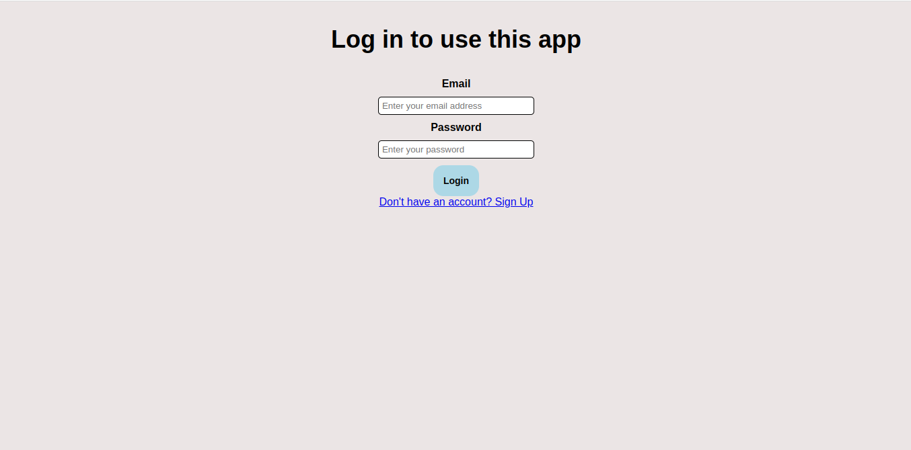
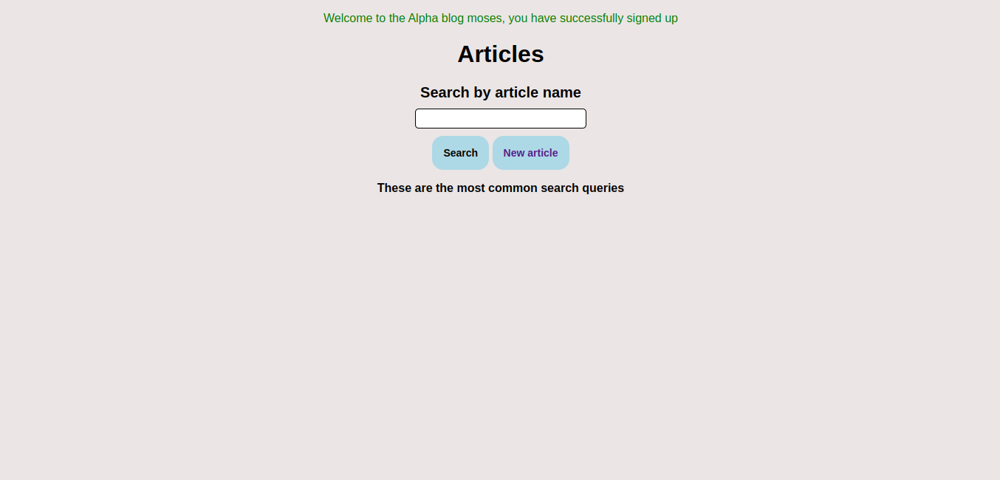

# HelpJuice Test Project

Live link: https://mysite-wum8.onrender.com/ (Deployed on Render)

> An app built with Rails that searches through Articles in Realtime and provides analytics.

### Home Page



### Clothes Page



## Tasks that can be performed
- A User can sign up for an account.
- A User can log in into that account.
- A User can add an article to the database (That article will be attributed that user).
- A User can search the database for specific articles.
- Analytics of most searched terms are returned.

## Built With

- Rails 7
- CSS

# Set Up

```
$ git clone https://github.com/emmyobonyo/rails-search-analytics.git
$ cd rails-search-analytics
$ bundle install
$ rails db:migrate
```
Navigate to `http://localhost:3000/` to check your app

## Authors

👤 **Emmanuel Obonyo**

- GitHub: [@emmyobonyo](https://github.com/emmyobonyo)
- LinkedIn: [Emmanuel Obonyo](https://www.linkedin.com/in/emmyobonyo/)

## 🤝 Contributing

Contributions, issues, and feature requests are welcome!

Feel free to check the [issues page]https://github.com/emmyobonyo/rails-search-analytics/issues).

## Show your support

Give a ⭐️ if you like this project!
